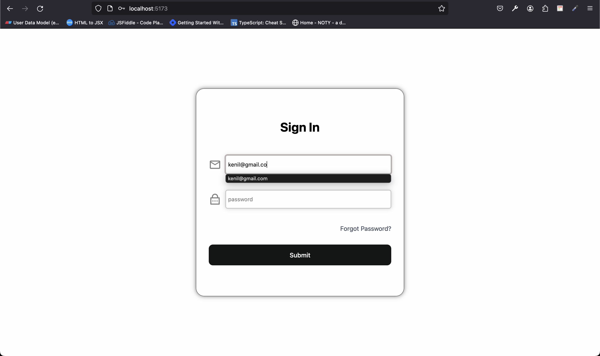

# LogIn Form with React

- By Looking at the image above, you can see that this is a simple LogIn Form with React.
- I have learned many react concepts while building this project.
- I have learned 'useRef' , 'useImperativeHandle()' , 'React.forwardRef()' by building this project.
- When you leave focus from the input field, it will show you the error message if you have not entered the correct value.
- When you click on the submit button, it will show you the error message if you have not entered the correct value.
- Validation of email and password is done by using regular expression.
- If the validation is unsuccessful, input field will turn red , error message will be shown and the input field will be shake in x-axis.
- If input validation is not successful and you click on the submit button, then the focus will be on the first input field which is invalid.